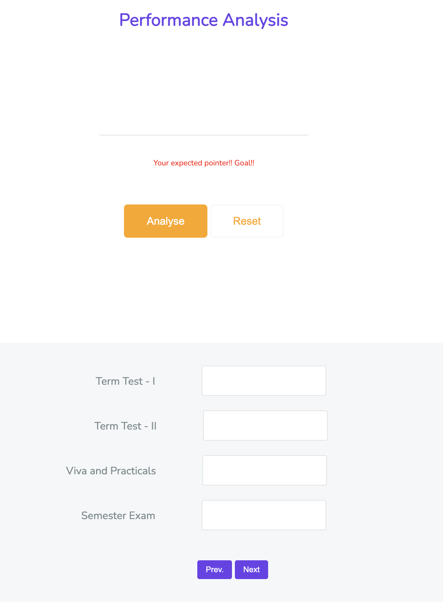
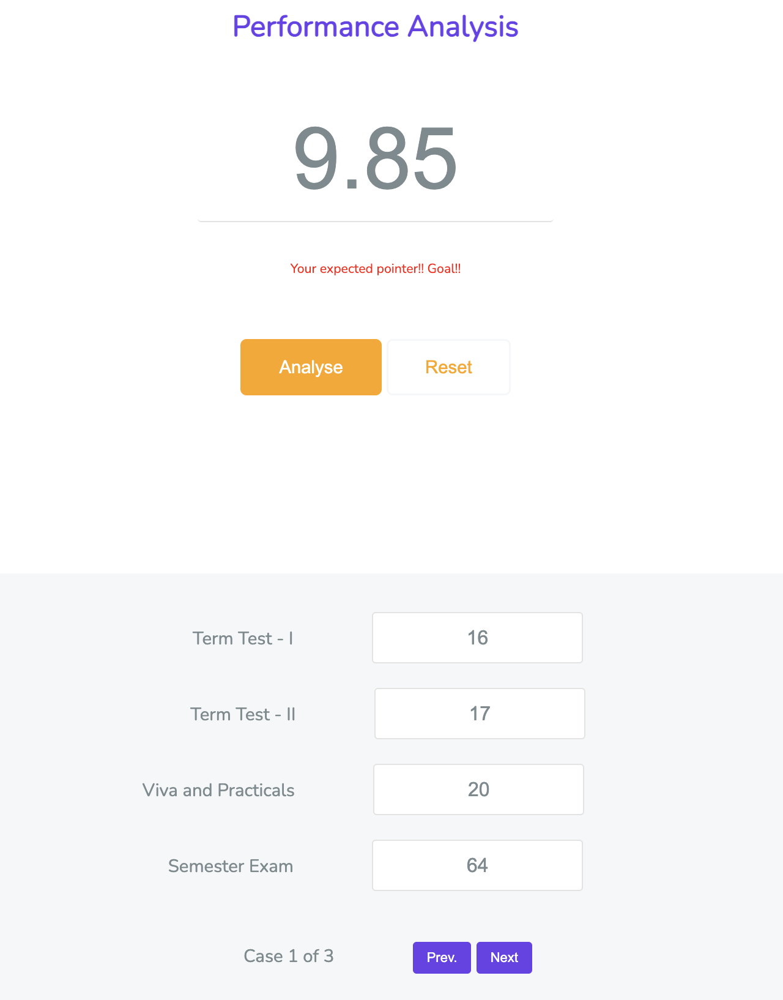
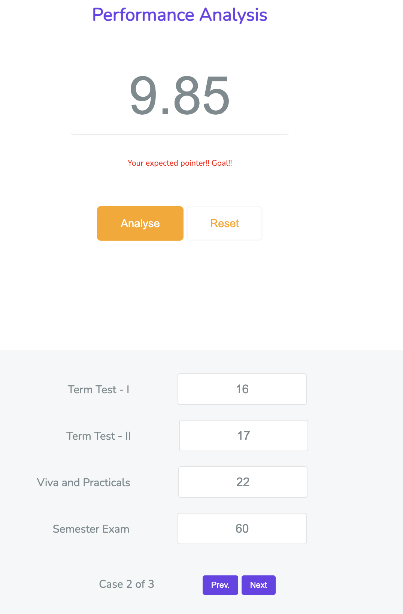
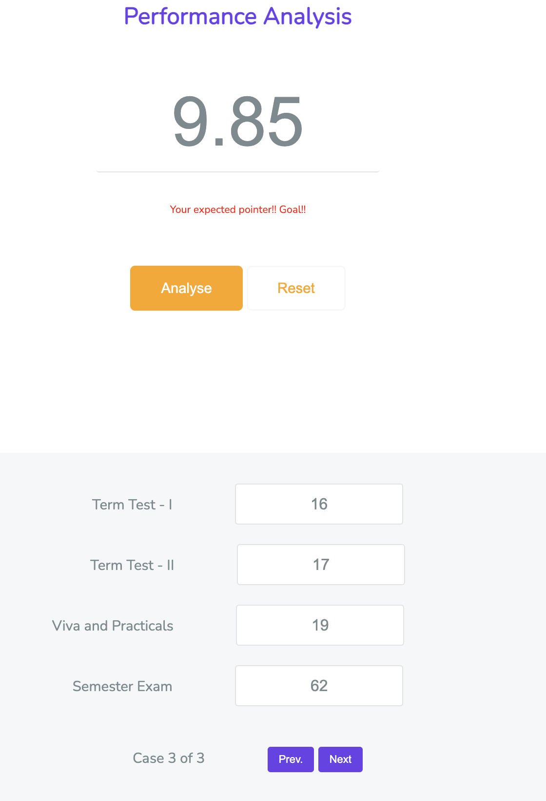

# Desired GPA Calculator
This repository contains a web application built using HTML, CSS, and JavaScript specifically designed for brainheaters.in. The GPA Calculator allows users to analyze and determine the required marks in term tests, vivas, practicals, and exams to achieve a desired GPA (Grade Point Average). The application provides three cases for calculating the marks needed in each category to attain the desired GPA.

## Functionality
The GPA Calculator provides the following functionality:
- Desired GPA: Users can input their desired GPA, the target they wish to achieve.
- Calculation of Marks: Based on the desired GPA, the application calculates three cases, each with different weightage distributions for term tests, vivas, practicals, and exams. The calculations provide users with the minimum required marks in each category to reach the desired GPA.
- Analysis and Comparison: Users can analyze and compare the three cases to identify the most suitable approach for their circumstances. This analysis helps determine the optimal allocation of marks in different categories to attain the desired GPA.

## Usage
To use this GPA Calculator web application, fork the repo and click on the HTML page. Once on this page, navigate to the GPA Calculator section. You will be presented with an interface where you can enter your desired GPA. After providing the desired GPA and hitting the calculate button, the application will display the three cases with the required marks for each category to achieve the desired GPA.

Please refer to the code provided in this repository for further information on how to use and implement the GPA Calculator web application.

## User-interface

